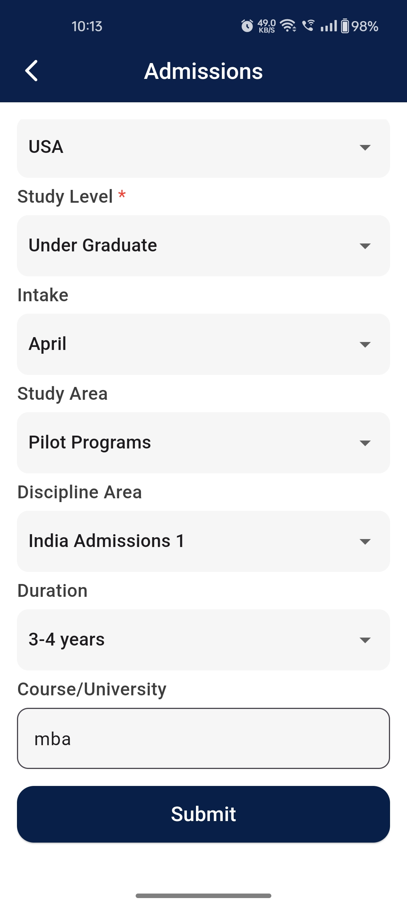
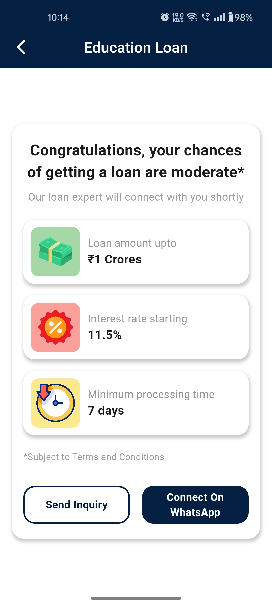

# Trencher.ai: Educational App
 
Platform : Flutter 
State Management : GetX 
 
 
Android App : https://play.google.com/store/apps/details?id=....
 
Ios App : https://apps.apple.com/us/app/.....
 
Web Site : https://.....
  
This application is developed for Student, student can check courses about Internation study with many more details like course details,course fees,course time duration, Addmission process etc... 

 
 

  
  
  
  
  

